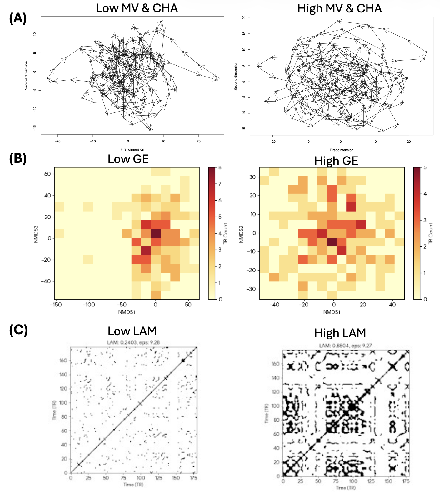

# stateMDS: Functional State Dynamics via Multidimensional Scaling

[](https://www.r-project.org/)
[](https://www.python.org/)
[](https://www.mathworks.com/products/matlab.html)
[](https://opensource.org/licenses/MIT)

## 🧠 Overview
**stateMDS** is a framework designed to quantify and visualize the dynamic trajectories of brain network states using resting-state fMRI (rsfMRI) data.


### The Concept
* **Functional State:** Defined as the spatial pattern of multi-voxel activity (BOLD signal intensities) captured at a single time point (TR) within a predefined network or ROI.
* **State Transition:** A temporal change in this multi-voxel pattern. By quantifying frame-by-frame changes, we capture the dynamic trajectory of a network’s activity.
* **Dimensionality Reduction:** Using Non-metric Multidimensional Scaling (NMDS), high-dimensional voxel-wise patterns are projected into a lower-dimensional space (e.g., 2D, 3D). 

This method is atlas-agnostic and can be applied to any network of interest (e.g., Default Mode Network, Salience Network) defined by standard atlases like **Schaefer**, **AAL3**, **DiFuMo**, or custom ROI sets.

---

### 📊 Schematic of Functional State Indices

To quantify the dynamic trajectory of brain states, we calculate several topological and dynamic indices:

<p align="center">
  
</p>

* **(A) Mean Velocity (MV):** The step-by-step Euclidean distance between consecutive TRs, representing the speed of state transition.
* **(A) Convex Hull Area (CHA):** A topological measure of the total state-space volume explored by the network over the scan duration.
* **(B) Grid Entropy (GE):** A measure of state-space distribution and occupancy. High entropy indicates a diverse, widely varying sequence of states, while low entropy indicates highly repetitive states.
* **(C) Laminarity (LAM):** Derived from Recurrence Quantification Analysis (RQA), indicating the tendency of the brain to get "stuck" in a specific state before transitioning.

---

## 📚 Resources & Bibliography

* **YouTube Tutorial Session:** A full 3-hour recording of an informal tutorial session. [Watch here](https://youtu.be/zDz5QLKrTHo?si=22w8gCQf-trRVcyF) *(Note: Core instruction spans 15:20 ~ 1:10:30).*
* **Key Publication:** Hsu, C.-W., et al. (2025). Functional Transition Rate of the Default Mode Network is Associated with Self-Reported Resilience. *Neuroimage*, 121508. [Read the paper here](https://doi.org/10.1016/j.neuroimage.2025.121508). *This is the key publication inaugurating this methodology.*

---

## 📂 Repository Structure

```text
stateMDS/
├── opendata_ADHD.py              # Automated Python ingestion & standardizing script
├── run_stateMDS.sh               # Master Bash Pipeline (Triggers R)
│
├── R/                            # Core R analysis and visualization scripts
│   ├── run_MDS_analysis.R                 # Step 1: NMDS & Velocity
│   ├── run_brain_indices.R                # Step 2: Compute CHA, GE, and LAM
│   ├── visualize_trajectories.R           # Step 3: Plotting
│   
├── matlab/                       # Legacy Preprocessing scripts
│   └── catCarryingVoxel.m                 # Voxel extraction using SPM12
│
├── data/               
│   ├── raw/                      # Sample 4D EPI volume (.nii) & Sample mask (.nii)
│   └── voxels/                   # Target directory for extracted voxel matrices (CSVs)
│
└── stateMDS.Rproj                # RStudio project file
```

---

## 📦 Requirements

You can run `stateMDS` using either our new Automated Python workflow, or the traditional MATLAB workflow. 

**1. Core R Dependencies (Required for all workflows):**
Run this inside your R console:
```R
install.packages(c("optparse", "vegan", "readr", "fs", "dplyr", "geometry", "entropy", "fields", "ggplot2", "plotly", "here"))
```

**2. Python Dependencies (For the Automated Nilearn Pipeline):**
It is highly recommended to use a virtual environment (`.venv`).
```bash
pip install numpy pandas nilearn scikit-learn nibabel matplotlib seaborn scipy
```

**3. MATLAB Dependencies (For the Legacy SPM Pipeline):**
* MATLAB (R2016b or later).
* SPM12 (Tested on revision 6906). The `spm_vol`, `spm_read_vols`, and `spm_get_data` functions must be in your MATLAB path.

---

## 🚀 How to Run the Analysis

We offer two distinct preprocessing pipelines depending on your workflow preferences: the modern Python/Nilearn automated pipeline, or the traditional MATLAB/SPM pipeline.

### Workflow A: The Unified Open-Source Pipeline (Python ➔ Bash ➔ R)
*Recommended for users who want fully reproducible, atlas-agnostic, and automated processing without proprietary software.*

**Route 1: End-to-End Open Data Pipeline**
Want to test the pipeline immediately? Run the Python master script. It acts as an intelligent data manager:
* **Intelligent Archiving:** Automatically detects if old `.csv` matrices exist in your `data/voxels/` folder and archives them with a timestamp to prevent accidental cohort mixing.
* **Automated Ingestion & Extraction:** Downloads the ADHD-200 dataset (or efficiently scans your local cache) and extracts the requested network (e.g., Default Mode Network) using Nilearn's `NiftiMasker`.
* **Temporal Standardization:** Because different subjects or scanning sites often have different scan lengths, the script parses the NIfTI headers to find the **global minimum TR count** across your selected cohort. It then slices every extracted matrix to this exact length. This ensures every subject has the exact same temporal opportunity to explore the state space, preventing artificial variance in Velocity or Convex Hull Area (CHA).
* **Automated Garbage Collection:** Neuroimaging datasets are massive. Once the script successfully finds the target cohort, it actively deletes the unused NIfTI and confound files from your local cache, keeping your hard drive safe from bloat.
* **Seamless Handoff:** Dynamically passes the standardized TR count directly into the Bash script's `-t` parameter, seamlessly triggering the full R-based NMDS pipeline without any manual configuration.

```bash
python opendata_ADHD.py
```

**Route 2: Bring Your Own Data (Local Execution)**
If you already have a folder of Time points × Voxels `.csv` files, you can skip Python entirely. Make the Bash script executable and run the pipeline:
```bash
chmod +x run_stateMDS.sh
./run_stateMDS.sh -d data/my_custom_voxels -o output_stateMDS -t 180
```

** ⚙️ Advanced Usage & Customization
You can fully customize the `run_stateMDS.sh` behavior using terminal flags:

* `-d` : Input directory containing TSV/CSV files (Default: `data/voxels`)
* `-o` : Main output directory (Default: `output_stateMDS`)
* `-t` : Maximum TRs to analyze per subject (Dynamically set by Python script, or default: `180`)
* `-s` : Maximum acceptable NMDS stress value (Default: `0.15`)
* `-k` : Maximum dimension to test (Default: `10`)
---

### Workflow B: The MATLAB / SPM Pipeline
*Recommended for users integrating with existing SPM12 preprocessing streams.*

**Step 1: Voxel Extraction (MATLAB)**
Use [`catCarryingVoxel.m`](https://github.com/yushiangsu/catCarryingVoxel) to extract values from your 4D EPI volumes using a mask (e.g., AAL3 or DiFuMo).
1. Open MATLAB and add SPM12 to your path.
2. Navigate to the `matlab/` folder.
3. Call the function using your mask and data:
   ```matlab
   % Example: mode 2 (base on data space), threshold 0.5
   [meanval, voxelval, voxmni, voxcor] = catCarryingVoxel('my_mask.nii', 'data/raw/4D_EPI_volume.nii', 2, 0.5);
4. Save the resulting `voxelval` as a CSV in `data/voxels/` (e.g., `subject1_voxels.csv`).

**Step 2: MDS Analysis & Indices (R)**
1. Open `stateMDS.Rproj` in RStudio.
2. Manually execute the R scripts in sequence:
   * Run `source("R/run_mds_analysis.R")`
   * Run `source("R/calculate_brain_indices.R")`
3. Generate Visualizations using the scripts in `R/` (e.g., `visualize_trajectories.R`, `plot_state_space_heatmap.R`).

---

## 📤 Outputs

Regardless of which workflow you choose, the pipeline yields standard outputs:

* `output/MDSpoint/`: CSVs containing only the selected dimension MDS coordinates over time per subject.
* `output/arrowdis/`: CSVs containing step-by-step displacement distances (Velocity).
* `output/Master_Velocity_Summary.csv`: Group-level summary containing the selected dimension, stress value, total distance, and mean velocity.
* `output/Brain_Indices_Summary.csv`: Contains topological metrics: `CHA_Norm`, `GE_Norm`, and `LAM_Norm`.
* `output/plots/`: Contains generated PNGs for 2D trajectories, GE heatmaps, and LAM recurrence plots.


## 📌 Implementation Notes
* **Extraction Modes (MATLAB):** `catCarryingVoxel` provides two modes. Use Mode 1 if your mask has a smaller voxel size than your data, or Mode 2 if you prefer to retain every voxel in the data space.
* **NIfTI Data:** A sample `4D_EPI_volume.nii` is included in `data/raw/` for testing your MATLAB extraction parameters.
* **Pathing:** Always use the `.Rproj` file to maintain relative pathing via the `here` package if running R scripts manually.